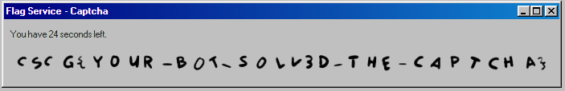

---
html:
  embed_local_images: true
  embed_svg: true
  offline: true
export_on_save:
  html: true
print_background: true
---
@import "../style.less"

# Captcha - localo

**Category:** Misc
**Difficulty:** Medium/Hard        
**Author:** LiveOverflow

## Description
>"The Enrichment Center regrets to inform you that this next test is impossible. Make no attempt to solve it. No one will blame you for giving up. In fact, quitting at this point is a perfectly reasonable response."
>
> http://hax1.allesctf.net:9200/
## Summery
The author provided a link to a website, we need to solve multiple Captcha stages to get the flag. If we fail on any Captcha, we have to try again from the beginning.

## Solution
If we fail at the first stage, we get the solution as the response. We can use that information to automatically generate and label a set to train an AI. The problem is not new and I took a look at many approaches since I have never done any machine learning (I just tried random adjustments to my AI until it kind of worked..). I used `Keras` [link](https://keras.io/) since it is beginner friendly and simple. I wrote an algorithm to separate the image into smaller pieces containing just one letter, but the algorithm didn't catch some cases, especially if there are two characters that are very close together and overlap. Therefore I used the data produced by the algorithm to train another AI. I manually sorted false labels. That AI is used to preprocess the segmented images, if the AI "thinks" that there is more than one character on the image, it splits the image in the middle. I could have used the aspect ratio, to guess if there are more than two overlapping characters, but since this is quite rare I didn't care. After training and readjusting the AI for a while, and gathering more data for `problem characters`, it got the flag after 40 tries. The lowercase `i` was mean.

## Code
Sorry for my dirty code :P

**code for solving:**
@import "solve.py"

@import "app.py"

**code for recognition data collection:**
@import "collect.py"

**code for recognition training:**
@import "train.py"

**code for segmentation data collection:**
@import "segmentation/collect.py"

**code for segmentation data training:**
@import "segmentation/train.py"

**code for segmentation prediction:**
@import "segmentation/predict.py"

## Mitigation
- use `reCAPTCHA` or something similar 

## Flag
CSCG{Y0UR_B0T_S0LV3D_THE_CAPTCHA}