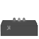

---
html:
  embed_local_images: true
  embed_svg: true
  offline: true
export_on_save:
  html: true
print_background: true
---
@import "../style.less"
# Polyrun - localo

**Category:** Misc       
**Difficulty:** Easy        
**Author:** explo1t

**Guessyness**: 
## Description
> Script.VeryBogusExecution
>
> Check it out at: http://lfi.hax1.allesctf.net:8081/
## Summery
A file called `run.pl` is provided by the challenge author. The file extension hints towards perl. Because the category of this challenge is labeled as `misc` which is roughly the same as `guessing` and the author is known for his guessing skills, everything can be expected.


## Solution
To analyse the file it can be run first. The stdout shows `Try Harder`.

After a short source code examination and several minutes of guessing and error the code is understood, but there is no flag and the code does not make any sense.

But there is a string that starts with
`#@~^UgAAAA==` and ends with `AAA==^#~@` and it show up again when we `print` the code instead of `eval`.
@import "run.pl" {as="perl" highlight=3}

I guess the first one is left there because the author wanted to be nice ;)

A quick google search reveals that the format is called `vbe` [link](https://isc.sans.edu/forums/diary/VBS+VBE/20953/) it is just an encoded `VB Script`. On the internet are many tools to decode it, I used [this](http://scriptbox.toll.at/index.php?showcontent=Decode%20VBE%20to%20VBS.vbs). After decoding it we get the flag.

```vb
' CSCG{This_is_the_flag_yo}
MsgBox "CSCG[THIS_NOT_REAL_FLAG]", VBOKOnly, "Nope"
```

## Mitigation
Next time XOR it with random stuff to make guessing harder.

## Flag
CSCG{This_is_the_flag_yo}